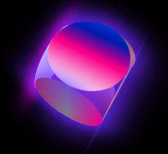

<p align="center">
  
</p>

<h1 align="center">Cubic-3D</h1>

## O que foi desenvolvido? 🚀

Um cubo 3D com transição de cores, utilizando apenas html e css. Você pode visualizar a página web [aqui](https://cubic-animation.vercel.app/)


<div align="center">
    Cubo 3D
</div>

## Tecnologias usadas 📚

- HTML5
- CSS3

## Desenvolvimento 🎬

Clonando o repositório:

```
git clone https://github.com/DanielSoaresRocha/Cubic-Animation.git
```

Navegando até a pasta do repositório:

```
cd Cubic-Animation
```

Rodando o projeto

<small>Abra o arquivo index.html no seu navegador</small>
<br />

## License 📝

This project is licensed under the [MIT License](https://opensource.org/licenses/MIT) - see the [LICENSE](LICENSE) file for details.

## Autor

<table>
  <tr>
    <td align="center"><a href="https://github.com/DanielSoaresRocha"><br /><sub><b>Daniel Soares</b></sub></a><br /><a href="https://github.com/DanielSoaresRocha/ESIG-challenge/commits?author=DanielSoaresRocha" title="Code">💻</a></td>
  <tr>
</table>
